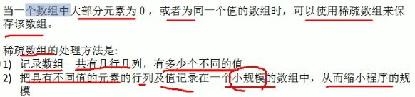

# Algorithm

## Introduction

快速匹配，暴力匹配效率低

回溯算法

N皇后，马踏棋盘算法，马走日字方式进行移动，遍历棋盘所有格子，采用图的深度优先算法

数据结构，分为线性结构和非线性结构

**算法是程序的灵魂**

## 数据结构和算法

### 数据结构

线性结构分为顺序存储和链式存储

这个结构特点是数据元素之间存在一对一的线性关系

常见的的包括数组，队列和栈

顺序表是连续的，链式存储不连续

非线性结构不是一对一的，树结构，和图结构很常用

#### 稀疏数组

把一个棋盘利用二维数组存储下来，利用稀疏数组

稀疏数组的例子

42个元素转换为27个元素，压缩了存储空间

应用实例，保存棋盘、地图

### 队列

先进先出，有序列表

