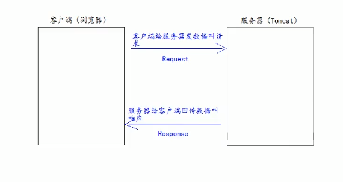
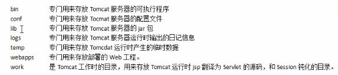
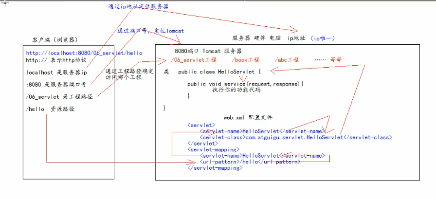
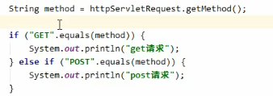
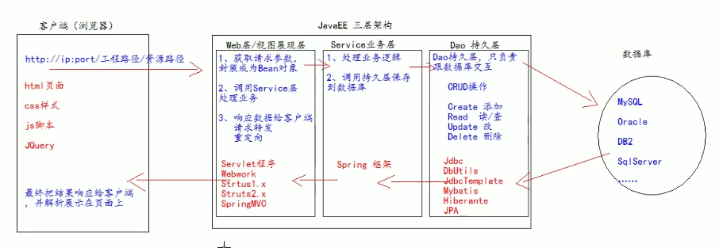
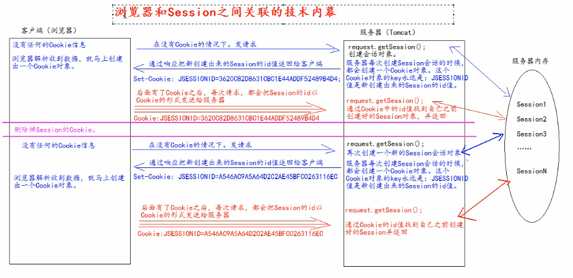

# Html基础

get请求的特点是：  

浏览器中 

# Jquery

$相当于window.onload

原生js的页面加载完成之后，只会执行最后一次的赋值函数

# XML

标签闭合 

必须要有引号包含，对大小写敏感

# JavaWeb

请求，客户端给服务器发数据叫请求

响应，服务器给客户端回传数据

web资源分类，分为静态资源和动态资源

静态资源：html、css、js

动态资源：jsp、serverlet

## Tomcat服务器

常见的web服务器：Tomcat jboss resin weblogic(收费)

目录介绍

## Servlet

这是JAVA EE的规范之一

三大组件之一：serverlet、filter、listener

可以接受客户端发送过来的请求，并响应数据给客户端

servlet执行顺序

### servlet 生命周期

get请求与post请求工作不一样

进行类型转换的时候需要进行类型转换。

合并方法

doGet和doPost   

## Http协议

客户端和服务器之间通信时需要遵守的协议

## JAVA EE

pojo实体类生成

需要编写Dao持久层

session和cookie与浏览器之间的技术细节

