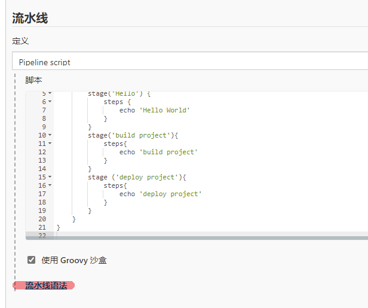
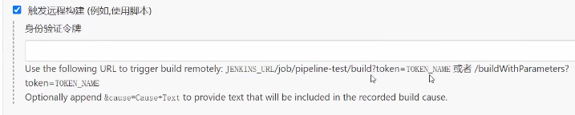
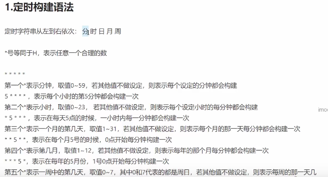
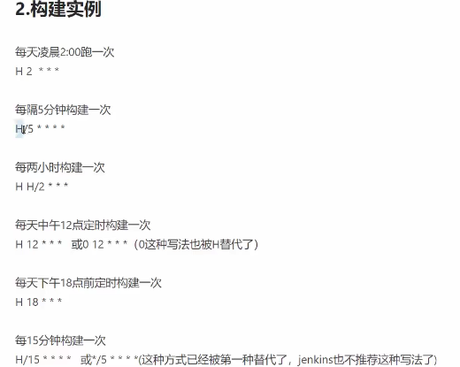

# Jenkins

主要讲述Jenkins+SVN

使用Jenkins apt安装

```
wget -q -O - https://pkg.jenkins.io/debian/jenkins.io.key | sudo apt-key add -
sudo sh -c 'echo deb http://pkg.jenkins.io/debian-stable binary/ > /etc/apt/sources.list.d/jenkins.list'
sudo apt-get update
sudo apt-get install jenkins
```

# Jenkins+SVN

需要三台机器

`rpm -ql jenkins`

启动Jenkins

`systemctl start jenkins`

查看进程

`ps -ef|grep jenkins`

查看端口

`netstat -antp 8080`

安装完成之后，打开8080端口网页，按照提示输入密码，密码存储在本地日志中

进入之后开始默认安装插件

```
管理密码
wangblack
Mountain
```

### MasterSlave

Jenkins独立一个机器，解决项目过多时，多个项目构建很花时间，采用分布式构建


解决Jenkins单点项目不足

新建节点，并发构建数，远程工作目录 /var/lib/jenkins

### PipeLine

创建流水线项目

创建Jenkinsfile并提交至源码控制仓库提供了一系列的好处

- 自动为所有分支和提交请求创建流水线构建过程
- 流水线的代码审查/迭代
- 审查流水线

### 新建任务

拉取代码，源码管理

轮询，每隔一段时间自动构建

### 构建后操作

构建后，将代码放远程服务器上进行运行，要实现这个功能，需要第三方插件`send build artifacts over ssh`

设置远程端口，将构建好的文件放置远程服务器

需要全局设置中，找到Publish over SSH，然后点击add，将远程服务器中添加至其中


SSH server配置


source files中传递所有文件写法 `target/**`

**freestyle风格**的问题

不便于维护，使用代码化的风格完成，采用pipeline模式，相对freestyle使用门槛高

### pipline

基于groovy的语法，建议使用生命式的语法Declarative Pipeline

```
stages{
	stage(){
		steps{
			echo 'pull code'
		}
	}
}
```



此处的流水线语法可以查看

### 引入JenkinsFile

放入web端会导致版本管理不方便，一旦jenkins挂掉了，文件也会丢失掉

在项目中写入一个jenkinsfile，在jenkins中选择从scm导入

可以在某一些情况下，不在手动构建，利用构建触发器，其他工程后出发，只需要填入一个其他工程项目，当这个工程项目触发后，响应的工程会自动触发。



触发远程，通过URL远程触发

#### 定时构建





#### 自动化部署

当有git操作时，jenkins自动对项目进行构建

**要实现自动构建操作，需要将项目部署到线上，或者采用内网穿透的方式**。否则，webhook无法将请求发送到jenkins中，导致jenkins无法根据push操作自动构建代码

若要实现自动构建，Jenkins 需获得远程代码仓库 Github 的读取权

##### 1. Github中获取访问token值,需要一个对项目有写权限的账户

**GitHub->setting->Developer setting->Personal access tokens->点击Generate new token**
 内容填写如下：


image.png


 创建成功后，token如下：


image.png


##### 2. Jenkins中Github配置中添加token凭证

**系统管理->添加Github server->添加Secret text凭证->连接测试
 同时，勾选为github指定另外一个hook url（配置Jenkins在Hook URL中监听Github的Post请求，然后进行自动构建）**


image.png


Secret text凭证添加如下：
 **类型需选择Secret text，Secret处输入Github中上面生成的token值**


image.png


**注意：**在操作过程，点击连接测试，可能会提示：Failed to validate the account，首先请确保添加凭证的类型是Secret text，其次secret值填写的是步骤1中生成的token值

##### 3. Github中项目配置webhook

settings->webhooks->Add webhook


image.png


image.png

**当结果如下：（前面所做的貌似都白做了？？）**


webhook连接


**因为填写的webhook是本地链接，Github无法成功访问所致，所以需要将本地发布到线上，或者通过ngrok实现内网穿透（ngrok服务器搭建）**
 后续再看吧，需要学习的东西还有很多啊


作者：张小Di
链接：https://www.jianshu.com/p/07b60b788088
来源：简书
著作权归作者所有。商业转载请联系作者获得授权，非商业转载请注明出处。
