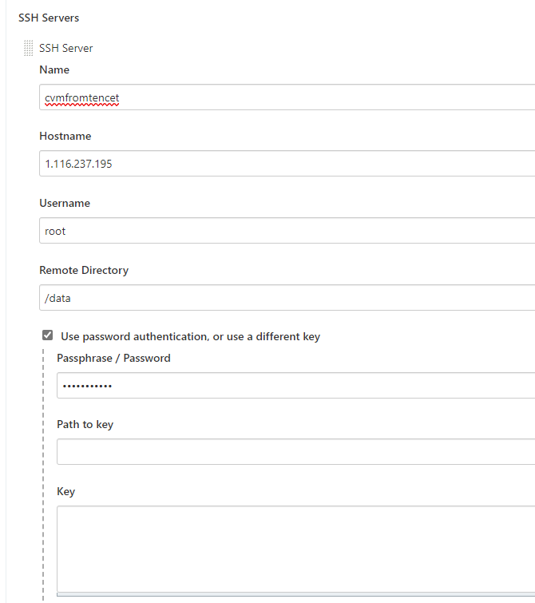

# Jenkins

主要讲述Jenkins+SVN

使用Jenkins apt安装

```
wget -q -O - https://pkg.jenkins.io/debian/jenkins.io.key | sudo apt-key add -
sudo sh -c 'echo deb http://pkg.jenkins.io/debian-stable binary/ > /etc/apt/sources.list.d/jenkins.list'
sudo apt-get update
sudo apt-get install jenkins
```

# Jenkins+SVN

需要三台机器

`rpm -ql jenkins`

启动Jenkins

`systemctl start jenkins`

查看进程

`ps -ef|grep jenkins`

查看端口

`netstat -antp 8080`

安装完成之后，打开8080端口网页，按照提示输入密码，密码存储在本地日志中

进入之后开始默认安装插件

```
管理密码
wangblack
Mountain
```

### MasterSlave

Jenkins独立一个机器，解决项目过多时，多个项目构建很花时间，采用分布式构建


解决Jenkins单点项目不足

新建节点，并发构建数，远程工作目录 /var/lib/jenkins

### PipeLine

创建流水线项目

创建Jenkinsfile并提交至源码控制仓库提供了一系列的好处

- 自动为所有分支和提交请求创建流水线构建过程
- 流水线的代码审查/迭代
- 审查流水线

### 新建任务

拉取代码，源码管理

轮询，每隔一段时间自动构建

### 构建后操作

构建后，将代码放远程服务器上进行运行，要实现这个功能，需要第三方插件`send build artifacts over ssh`

设置远程端口，将构建好的文件放置远程服务器

需要全局设置中，找到Publish over SSH，然后点击add，将远程服务器中添加至其中


SSH server配置




source files中传递所有文件写法 `target/**`

**freestyle风格**的问题

不便于维护，使用代码化的风格完成，采用pipeline模式，相对freestyle使用门槛高
