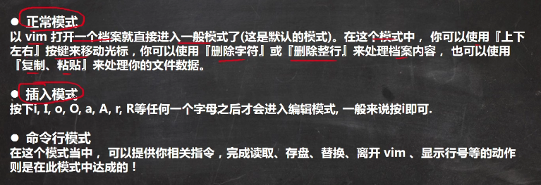
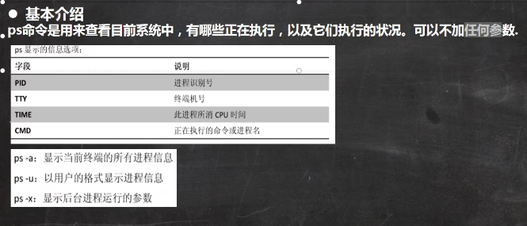
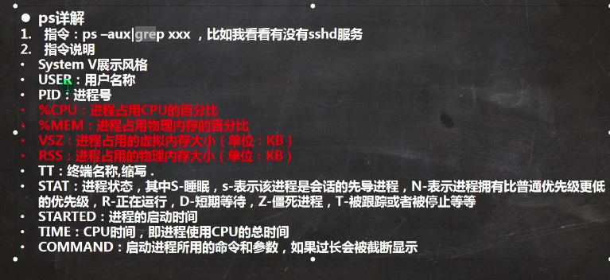
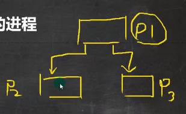
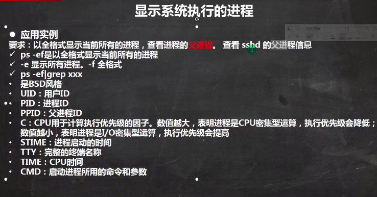
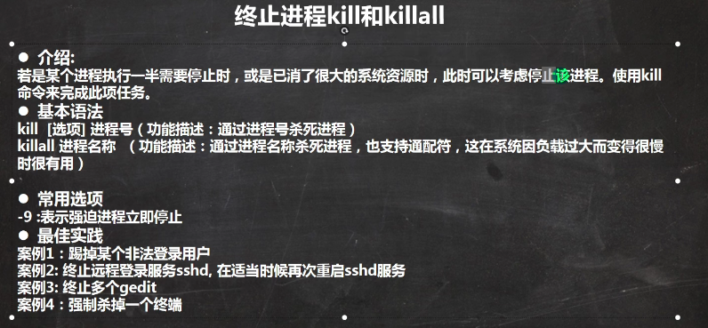

# Linux

### vi和vim

两个编辑器的快捷键一样



三种操作模式


## clash配置

首先参照官方配置一个dameon

Copy Clash binary to `/usr/local/bin` and configuration files to `/etc/clash`:

```
$ cp clash /usr/local/bin
$ cp config.yaml /etc/clash/
$ cp Country.mmdb /etc/clash/
```

Create the systemd configuration file at `/etc/systemd/system/clash.service`:

```
[Unit]
Description=Clash daemon, A rule-based proxy in Go.
After=network.target

[Service]
Type=simple
Restart=always
ExecStart=/usr/local/bin/clash -d /etc/clash

[Install]
WantedBy=multi-user.target
```

Launch clashd on system startup with:

```
$ systemctl enable clash
```

Launch clashd immediately with:

```
$ systemctl start clash
```

Check the health and logs of Clash with:

```
$ systemctl status clash
$ journalctl -xe
```

#### 代理设置

由于服务器没有图形化界面，所以采用命令行配置全局代理

把代理服务器地址写入shell配置文件.bashrc或者.zshrc 直接在.bashrc或者.zshrc添加下面内容

把以下内容添加进去即可生效

```text
export http_proxy="http://localhost:port"
export https_proxy="http://localhost:port"
```

或者走socket5协议（ss,ssr）的话，代理端口是1080

```text
export http_proxy="socks5://127.0.0.1:1080"
export https_proxy="socks5://127.0.0.1:1080"
```

或者干脆直接设置ALL_PROXY

```text
export ALL_PROXY=socks5://127.0.0.1:1080
```

最后在执行如下命令应用设置

```text
source ~/.bashrc
```

#### 查看端口使用情况

已经连接的服务端口

`netstat -a`

查看所有的服务端口（LISTEN，ESTABLISHED）
`netstat -ap`
查看指定端口，可以结合grep命令：
`netstat -ap | grep 8080`
 也可以使用lsof命令：
`lsof -i:8888`
若要关闭使用这个端口的程序，使用kill + 对应的pid


`kill -9 PID号`

### 文件复制

#### 1、从本地复制到远程

命令格式：

```
scp local_file remote_username@remote_ip:remote_folder 
或者 
scp local_file remote_username@remote_ip:remote_file 
或者 
scp local_file remote_ip:remote_folder 
或者 
scp local_file remote_ip:remote_file 
```


- 第1,2个指定了用户名，命令执行后需要再输入密码，第1个仅指定了远程的目录，文件名字不变，第2个指定了文件名；
- 第3,4个没有指定用户名，命令执行后需要输入用户名和密码，第3个仅指定了远程的目录，文件名字不变，第4个指定了文件名；

应用实例：

```
scp /home/space/music/1.mp3 root@www.runoob.com:/home/root/others/music 
scp /home/space/music/1.mp3 root@www.runoob.com:/home/root/others/music/001.mp3 
scp /home/space/music/1.mp3 www.runoob.com:/home/root/others/music 
scp /home/space/music/1.mp3 www.runoob.com:/home/root/others/music/001.mp3
```

### 进程查看

`ps`指令



三个指令组合使用

```
查看所有进程
ps -aux
grep 过滤用户
ps -aux | grep sshd
```

- user 进程执行用户
- PID 进程名
- MEM 占用物理内存的百分比
- STAT 运行状态， s表示sleep休眠，r表示run运行状态
- START 执行开始的时间
- TIME 占用的CPU时间
- command 进程名，执行该进程所用的命令和参数



**父进程**



可以有多个子进程



```
ps -ef|grep sshd
```

**终止进程**



```
kill 进程号，kill 11421
终止远程登录sshd
重启sshd
/bin/systemctl start sshd.service
终止所有gedit编辑器,通过进程名干掉所有子进程
killall gedit
强制终止
kill -9 进程号
```

### 端口查看

netstat命令查看端口

**netstat -tunlp** 用于显示 tcp，udp 的端口和进程等相关情况。

netstat 查看端口占用语法格式：

```
netstat -tunlp | grep 端口号
```

- -t (tcp) 仅显示tcp相关选项
- -u (udp)仅显示udp相关选项
- -n 拒绝显示别名，能显示数字的全部转化为数字
- -l 仅列出在Listen(监听)的服务状态
- -p 显示建立相关链接的程序名

例如查看 8000 端口的情况，使用以下命令：

```
# netstat -tunlp | grep 8000
tcp        0      0 0.0.0.0:8000            0.0.0.0:*               LISTEN      26993/nodejs   
```

更多命令：

```
netstat -ntlp   //查看当前所有tcp端口
netstat -ntulp | grep 80   //查看所有80端口使用情况
netstat -ntulp | grep 3306   //查看所有3306端口使用情况
```

## 用户管理

linux下管理用户与windows平台存在不一致的情况，linux关于用户文件的存储位置

- `/etc/passwd`：是用于保存用户信息的文件
- `/etc/shadow`：保存了用于的密码信息
- `/etc/group`：保存了组信息

root用户可以创建多个用户

**添加用户**

```
useradd 用户名
```

默认该用户的默认目录为`/home/用户名`

可以通过`-d`指定默认目录

```
useradd -d /home/test kin
kin所在的目录为test
```

**修改密码**

```
passwd 用户名
```

**删除用户**

```
userdel 用户名
保留家目录
userdel 用户名
删除用户及家目录(慎重)
userdel -r 用户名
```

- 删除用户名，但是保留家目录
- 删除用户名和家目录

一般情况下，建议保留

#### 查询用户信息

```
id 用户名
```

切换用户

```
su - 切换用户名
```

从权限高的用户切换到权限低的用户，不需要输入密码，反之，需要输入密码

#### 查看用户

`$`表示普通管理员，`#`表示系统管理员，使用远程ssh登录的时候，需要进入主机设置用户密码

查看用户的命令

```
当前正在使用的用户名
w
who
users
查看系统中所有用户
grep bash /etc/passwd
```

#### 创建用户／设置密码／删除用户

| 命令                                           | 作用         | 说明                                                         |
| ---------------------------------------------- | ------------ | ------------------------------------------------------------ |
| useradd -m -g 组名 -u ID号 -s /bin/bash 用户名 | 添加新用户   | -m：自动建立用户家目录； -g：指定用户所在的组，无则为用户名组 -u：指定用户ID号，ID值时尽量要大于500 －s：指定用户登入后所使用的shell |
| passwd 用户名                                  | 设置用户密码 | 如果是普通用户，直接用 passwd 可以修改自己的账户密码         |
| userdel -r 用户名                              | 删除用户     | -r 选项会自动删除用户家目录                                  |
| cat /etc/passwd \| grep 用户名                 | 确认用户信息 | 新建用户后，用户信息会保存在/etc/passwd文件中                |

## 文件权限

#### 文件权限说明

`ls -l`可以查看文件夹下文件的详细信息，从左到右依次是：

```bash
d rwxr-xr-x. 21 root root 4.0k 12月 21 22：22 var
类型 权限 硬链接数 所属用于 所属用户组 大小 时间 名称
```

- 类型：`-`普通文件；`d`目录文件；`b`块特殊文件；`l`符号链接；`f`命名管道；`s`套接字文件；
- 权限：分别为**u=拥有者权限，g=组权限，o=其他用户权限**

| 权限    | 缩写 | 数字代号 |
| ------- | ---- | -------- |
| read    | r    | 4        |
| write   | w    | 2        |
| execute | x    | 1        |

> 权限限制的是非root用户，对于root用户而言没用
>
> 除了上述的读写执行权限，还有一些特殊权限：`SUID,SGID,SBIT`，不建议修改

- **硬链接数**，通俗地讲，就是有多少种方式，可以访问到当前目录/文件

#### 权限修改

| 序号 | 命令  | 作用       |
| ---- | ----- | ---------- |
| 01   | chown | 修改拥有者 |
| 02   | chgrp | 修改组     |
| 03   | chmod | 修改权限   |

- 命令格式如下：

```bash
# 修改文件|目录的拥有者
chown 用户名 文件名|目录名
# 修改文件|目录的组
chown :组名 文件名|目录名

# 递归修改文件|目录的组
chgrp -R 组名 文件名|目录名
 
# 递归修改文件权限
chmod -R 755 文件名|目录名
# 对拥有者添加执行权限
chmod u+x 文件名
# 对组删除写权限
chmod g-w 文件名
# 令其他用户的权限为可读
chmod o=r 文件名
# 对所有成员都加上读取权限
chmod a+r 文件名
```

- `chmod` 在设置权限时，可以简单地使用三个数字分别对应**u=拥有者/g=组/o=其他**用户的权限

```bash
chmod num1num2num3 文件名|目录名
```

> 当拥有者权限和组权限冲突时，已拥有者权限为准

### 常见文件操作

- zip文件解压

在基于 [Unbutu](https://link.zhihu.com/?target=https%3A//ubuntu.com/) 和 [Debian](https://link.zhihu.com/?target=https%3A//www.debian.org/) 的发行版上，你能够使用下面的命令来安装 `unzip`。如果你已经安装了，你会被告知已经被安装。

```text
sudo apt install unzip
```

一旦你能够确认你的系统中安装了 `unzip`，你就可以通过 `unzip` 来解压 zip 归档文件。

你也能够使用命令行或者图形工具来达到目的，我会向你展示两种方法：

- 解压到文件夹下

在 Linux 命令行下，对于把文件解压到一个文件夹下是一个好的做法。这种方式下，所有的提取文件都会被存储到你所指定的文件夹下。如果文件夹不存在，会创建该文件夹。

```text
unzip zipped_file.zip -d unzipped_directory
```

现在 `zipped_file.zip` 中所有的内容都会被提取到 `unzipped_directory` 中。

由于我们在讨论好的做法，这里有另一个注意点，我们可以查看压缩文件中的内容而不用实际解压。

***.tar 文件**

```
tar –xvf file.tar    //解压 tar包
```

***.tar.gz 和 \*.tgz 文件**

```
tar -xzvf file.tar.gz    //解压tar.gz
```

***.gz 文件**

```
gunzip FileName.gz    //第一种 *.gz 解压
gzip -d FileName.gz    //第二种 *.gz 解压、

文件压缩
gzip FileName
```

***.bz2 文件**

```
bzip2 -d FileName.bz2    //第一种解压 *.bz2 文件
bunzip2 FileName.bz2    //第二种解压 *.bz2 文件
```

***.tar.bz2 文件**

```
tar jxvf FileName.tar.bz2    //第一种解压 *.tar.bz2 文件
tar --bzip xvf FileName.tar.bz2    //第二种解压 *.tar.bz2 文件m
```

***.zip 文件**

```
unzip FileName.zip    //解压 *.zip 文件
```

***.rar 文件**

```
unrar e Filename.rar　　//解压 *.rar 文件
```

## Remote Coding

### 查看GPU占用，每秒刷新 watch -n 1 nvidia-smi 

以后台运行的方式运行python文件，并输出到nohup.out文件 

`nohup python -u train_autodeeplab.py >> nohup.out 2>&1 & `

apex文件夹安装为资源文件 

```
git clone https://github.com/NVIDIA/apex 
cd apex python3 setup.py install
```

查看nohup.out文件 # 实时打印：`tail -f nohup.out `

显示最后1000行：`tail -1000 nohup.out `

### Linux nohup 命令

#### 语法格式

```
 nohup Command [ Arg … ] [　& ]
```

#### 参数说明：

**Command**：要执行的命令。

**Arg**：一些参数，可以指定输出文件。

**&**：让命令在后台执行，终端退出后命令仍旧执行。

#### 实例

以下命令在后台执行 root 目录下的 runoob.sh 脚本：

```
nohup /root/runoob.sh &
```

在终端如果看到以下输出说明运行成功：

```
appending output to nohup.out
```

这时我们打开 root 目录 可以看到生成了 nohup.out 文件。

如果要停止运行，你需要使用以下命令查找到 nohup 运行脚本到 PID，然后使用 kill 命令来删除：

```
ps -aux | grep "runoob.sh" 
```

参数说明：

- **a** : 显示所有程序
- **u** : 以用户为主的格式来显示
- **x** : 显示所有程序，不区分终端机

以下命令在后台执行 root 目录下的 runoob.sh 脚本，并重定向输入到 runoob.log 文件：

```
nohup /root/runoob.sh > runoob.log 2>&1 &
```

**2>&1** 解释：

将标准错误 2 重定向到标准输出 &1 ，标准输出 &1 再被重定向输入到 runoob.log 文件中。

- 0 – stdin (standard input，标准输入)
- 1 – stdout (standard output，标准输出)
- 2 – stderr (standard error，标准错误输出)

### 切换用户

第一次使用root用户时需要重新设置用户密码

```
sudo passwd root
```

按照提示更新密码后，才可以自有切换到root用户

```
su
```

