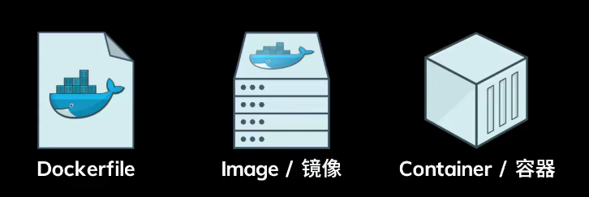

# mongoDB学习日记

mongod.conf文件


## MongoDB卸载

直接上操作

1.停止 mongodb服务

`sudo service mongod stop`

2.卸载mongodb

`sudo apt-get remove mongodb`

3.移除相关包

```
sudo apt-get purge mongodb-org*

sudo apt-get purge mongodb

sudo apt-get autoremove

sudo apt-get autoclean
```

4.移除相关目录

```
sudo rm -r /var/log/mongodb
sudo rm -r /var/lib/mongodb
```

5.查看系统还有哪些残留的文件或目录

```
whereis mongo

whereis mongodb

whereis mongod

which mongo

which mongodb

which mongod
```

# Docker




Dockfile 自动化脚本
