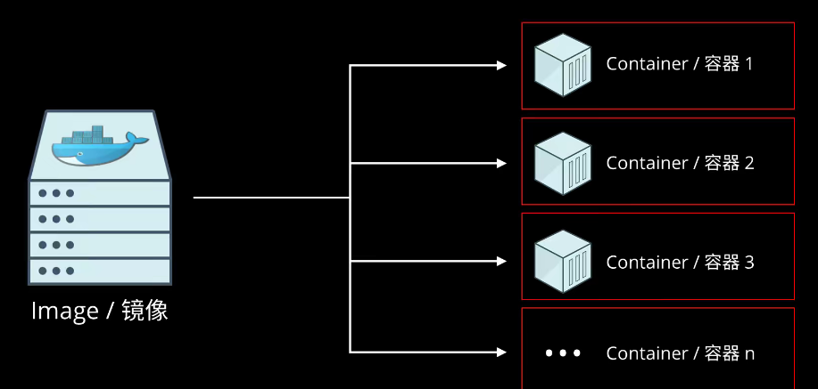

# mongoDB学习日记

mongod.conf文件


## MongoDB卸载

linux下的卸载命令

1.停止 mongodb服务

`sudo service mongod stop`

2.卸载mongodb

`sudo apt-get remove mongodb`

3.移除相关包

```
sudo apt-get purge mongodb-org*

sudo apt-get purge mongodb

sudo apt-get autoremove

sudo apt-get autoclean
```

4.移除相关目录

```
sudo rm -r /var/log/mongodb
sudo rm -r /var/lib/mongodb
```

5.查看系统还有哪些残留的文件或目录

```
whereis mongo

whereis mongodb

whereis mongod

which mongo

which mongodb

which mongod
```

# Docker




Dockfile 自动化脚本

### 配置

windows下mongodb安装需要在bin同级目录下创建data文件夹

利用cmd将mongod.exe与data文件夹创建关联

```
mongod -dbpath=..\data\db
```

 使用shell链接

```
mongo --host=localhost --port=27017
```

#### linux安装

### 创建数据和日志目录。

创建一个目录，MongoDB实例将在该目录中存储其数据。例如：

```
sudo mkdir -p /var/lib/mongo
```

创建一个目录，MongoDB实例将在该目录中存储其日志。例如：

```
sudo mkdir -p /var/log/mongodb
```

启动MongoDB进程的用户必须具有对这些目录的读写权限。例如，如果您打算自己运行MongoDB：

```
sudo chown `whoami` /var/lib/mongo     # Or substitute another user
sudo chown `whoami` /var/log/mongodb   # Or substitute another user
```

#### 问题解决

出现`mongod.service: Failed with result 'exit-code'.`问题解决方法

新建两个目录

```
sudo mkdir /var/lib/mongodb
sudo mkdir /var/log/mongodb
```

改变拥有属性

```
sudo chown -R mongodb:mongodb /var/lib/mongodb
sudo chown -R mongodb:mongodb /var/log/mongodb
```

### 使用

```
use 数据库名
没有的话会自动创建

展示当前数据库,这个命令会展示当前运行的是哪个数据库
db

展示数据库
show dbs or database

```

admin：用户数据权限

local：

#### 删除数据库

进入数据库后，使用drop命令删除该数据库

```
use temp
db.dropDatabase()
```

#### 集合

显示创建

```
db.createCollection("my")
```

##### 集合删除

````
db.my.drop()
````

##### 集合插入

使用insert和save语句插入

```
db.集合名.insert
如果没有集合名会隐式的创建
插入成功
WriteResult({ "nInserted" : 1 })
```

批量插入

```
db.集合名.insertMany([
	{},
	{}.
])
类似json数组

```


##### 集合查询

```mongo
查询所有
db.集合名.find()
查询单个
db.集合名.find({aritcle:"1000"})
```

查询第一条数据，{}中写入要查询的数据

```
db.comment.findOne({articleid:"10001"})
```

#### 投影查询

我们对文档进行查询并不是需要所有的字段, 比如只需要 id 或者 用户名, 我们可以对文档进行“投影”

`db.commnet.find({article:id},{article:1})`表示只显示改行，`db.commnet.find({article:id},{article:1，_id:0})`表示排除主键

批量插入文档时，为了防止某一条数据插入错误，无法定位错误源。使用try/catch解决

主键id一般不自己生成

```
try{
db.集合名.insertMany(
	{},
	{},
	{}
	)
}catch(e){
	print(e)
}

try {
  db.comment.insertMany([
    {"_id":"1","articleid":"100001","content":"我们不应该把清晨浪费在手机上, 健康很重要, 一杯温水幸福你我 他.","userid":"1002","nickname":"相忘于江湖","createdatetime":new Date("2019-0805T22:08:15.522Z"),"likenum":NumberInt(1000),"state":"1"},
    {"_id":"2","articleid":"100001","content":"我夏天空腹喝凉开水, 冬天喝温开水","userid":"1005","nickname":"伊人憔 悴","createdatetime":new Date("2019-08-05T23:58:51.485Z"),"likenum":NumberInt(888),"state":"1"},
    {"_id":"3","articleid":"100001","content":"我一直喝凉开水, 冬天夏天都喝.","userid":"1004","nickname":"杰克船 长","createdatetime":new Date("2019-08-06T01:05:06.321Z"),"likenum":NumberInt(666),"state":"1"},
    {"_id":"4","articleid":"100001","content":"专家说不能空腹吃饭, 影响健康.","userid":"1003","nickname":"凯 撒","createdatetime":new Date("2019-08-06T08:18:35.288Z"),"likenum":NumberInt(2000),"state":"1"},
    {"_id":"5","articleid":"100001","content":"研究表明, 刚烧开的水千万不能喝, 因为烫 嘴.","userid":"1003","nickname":"凯撒","createdatetime":new Date("2019-0806T11:01:02.521Z"),"likenum":NumberInt(3000),"state":"1"}

]);

} catch (e) {
  print (e);
}
```

#### 文档的更新

语法

```
db.集合名.update({query},{update},options)
db.commnet.update()
```

覆盖性更新

这种更新方式会覆盖该条件下所有的数据项

```
 db.comment.update({_id:"1"},{userid:NumberInt(10)})
```

局部更新，只更新那一条数据

```
 db.comment.update({_id:"2"},{$set:{userid:NumberInt(10)}})
```

批量修改数据

更新所有查询数据

```
db.comment.update({userid:"1003"},{$set:{nickname:"list"}},{multi:true})
```

**列值增长修改**

如果我们想实现对某列值在原有值的基础上进行增加或减少, 可以使用 `$inc` 运算符来实现

```
db.comment.update({_id:"3"},{$inc:{likenum:NumberInt(1)}})
```

**删除文档**

```
db.集合名.remove(选项)
删除某一项
```

### 文档的分页查询

1. 统计所有记录数

```
db.集合名.count()
```

2. 按条件统计记录数

```
db.集合名.count({条件})
```

3. 分页列表查询

`db.comment.find({},{userid:"1003"})`其中find({},{条件})会限制其他条件的出现，导致仅出现userid这一个

仅显示前几条数据

```
db.集合名.find().limit(数字)
```

skip方法，跳过查询出来所有的n条数据

```
db.集合名.find().limit(数字).skip(n)
```

4. 排序查询

`db.集合名.find().sort({userid:1})`查询出来的数据，按照userid进行升序排列，1表示升序，0表示降序排列

##### 正则查询

```
db.集合名.find({content:/开水/})
后面紧跟着正则查询
```

##### 比较查询

```
db.集合名.find({field:{$gt:value}}) //大于：field>value
```

##### 包含查询

查询评论的集合中userid字段包含1003或1004的文档id in{1,2,3}

`db.comment.find({userid:{$in:["1003","1004"]}})`

不包含使用`$nin`操作符，查询出的结果不包含这几个文档

##### 连接查询

```
db.comment.find({$and:[{条件1}，{条件2]})
db.集合名.find($and:[{likenum:{$gte:NumberInt(700)}},{likenum:{$lt:NumberInt(2000)}}])
```

#### 常用小结


### 索引

索引是为了减少查询的条数


在某一个字段建立索引，使得该字段从大到小或者从小到大排列，后面的查询可以提高效率

**复合索引**

多个字段的用户定义索引，列出的字段顺序具有重要意义 ，例如`{userid:1,score:-1}`组成，则索引首先按userid正序排序，然后按score倒序排序

#### 索引的查看

返回一个集合中的所有索引的数组。

```
db.集合名.getIndexes()
```


_id:表示升序

#### 创建索引

```
db.集合名.createIndex(keys,options)
```


单字段索引示例

```
db.comment.createIndex({userid:1})
建立一个升序的索引
```


##### 索引的删除


```
db.集合名.dropIndex(index)
删除userid的升序索引
db.comment.dropIndex({userid:1})
删除所有索引
db.comment.dropIndexes()
```

<<<<<<< HEAD
#### 执行计划

想知道查询结果是否有效

```
db.collection.find(query,options).explain(options)

```

=======
#### 索引的使用

**执行计划**

分析查询性能，解释计划，查看查询的情况，如查询耗费时间，是否基于索引查询等

```
db.集合名.find(query，options).explain(options)
```

关键点看： "stage" : "COLLSCAN", 表示全集合扫描。

**涵盖的查询**

当查询条件和和查询的投影仅包含索引字段时，MongoDB直接从索引返回结果，就不会去扫描文档，使得查询速度非常快


## 文章评论

实现功能：

- 基本增删改查API
- 根据文章id查询评论
- 评论点赞

#### 表结构分析


#### spring配置

使用spring来搭建服务架构

使用mongoDB框架来链接spring

```java
<dependency>
            <groupId>org.springframework.boot</groupId>
            <artifactId>spring-boot-starter-data-mongodb</artifactId>
        </dependency>
```

**yml配置**

```java
spring:
  data:
    mongodb:
#      主机名
      host: 127.0.0.1
#      数据库
      database: articledb
#      默认端口
      port: 27017
```

**启动类**

使用springboot不需要添加启动类

运行启动类，观察是否报错，是否出现一下语句

```
[           main] org.mongodb.driver.cluster               : Cluster created with settings {hosts=[127.0.0.1:27017], mode=SINGLE, requiredClusterType=UNKNOWN, serverSelectionTimeout='30000 ms'}
```

**实体类**

可能出现一个collection对应多个实体类

```Java

@Data
// 可以省略，如果省略，则默认使用类名小写
@Document(collection = "comment")
// 复合索引,推荐使用命令行构建
@CompoundIndex(def = "{'userid':1,'nickname':-1}")
public class Comment {
//    主键标识
    @Id
    private String id;
//    该字段对应mongodb的字段的名字，如果一致，则无需该注解
//    @Field("content")
    private String content;
    private Date publishtime;
//    添加了一个单字段索引
    @Indexed
    private String userid;
    private String nickname;
    private LocalDateTime createdatetime;
    private Integer likenum;
    private Integer replynum;
    private String state;
    private String parentid;
    private String articleid;

    @Override
    public String toString() {
        return "Comment{" +
                "id='" + id + '\'' +
                ", content='" + content + '\'' +
                ", publishtime=" + publishtime +
                ", userid='" + userid + '\'' +
                ", nickname='" + nickname + '\'' +
                ", createdatetime=" + createdatetime +
                ", likenum=" + likenum +
                ", replynum=" + replynum +
                ", state='" + state + '\'' +
                ", parentid='" + parentid + '\'' +
                ", articleid='" + articleid + '\'' +
                '}';
    }
}
```


**测试**

如果不指定id，mongodb会自动生成一个ID，类似UUID的写法

```java
    /**
     * 保存一个评论
     */
    @Test
    public void testSaveComment(){
        Comment comment=new Comment();
        comment.setArticleid("100000");
        comment.setContent("测试添加的数据");
        comment.setCreatedatetime(LocalDateTime.now());
        comment.setUserid("1003");
        comment.setNickname("凯撒大帝");
        comment.setState("1");
        comment.setLikenum(0);
        comment.setReplynum(0);
        commentService.saveComment(comment);
    }
```

#### 根据上机ID查询文章评论的分页列表

commentrepository新增方法定义

评论点赞

根据id查询出用户当前点赞数，将当前点赞数+1，然后保存至数据库。

简单易实现，但是IO过大

```java
/**
* 点赞-效率低
* @param id
*/
public void updateCommentThumbupToIncrementingOld(String id){
Comment comment = CommentRepository.findById(id).get();
comment.setLikenum(comment.getLikenum()+1);
CommentRepository.save(comment);
}
```

使用mongoTemplate来实现对某列的操作，变更service的写法

```java
	@Autowired
    MongoTemplate mongo;    
	/**
     * 适应大规模动态更新点赞情况
     */
    public void updateCommentLikenum(String id){
//        查询对象
        Query query = Query.query(Criteria.where("_id").is(id));
//        更新对象
        Update update=new Update();
        update.inc("likenum");
//        参数1：查询对象
//        参数2：更新对象
//        参数3：集合的名字或实体类的类型comment.class
        mongo.updateFirst(query,update,"comment");
    }

```

测试更新的可用性

```java
@Test
    public void testUpdateCommentLikenum(){
        commentService.updateCommentLikenum("1");
    }
```

## 集群和安全


副本集架构目标

一主一副本一仲裁，在同一台云服务器上为了区分彼此，采用不同的端口号构建相应的服务


>>>>>>> refs/remotes/origin/main
