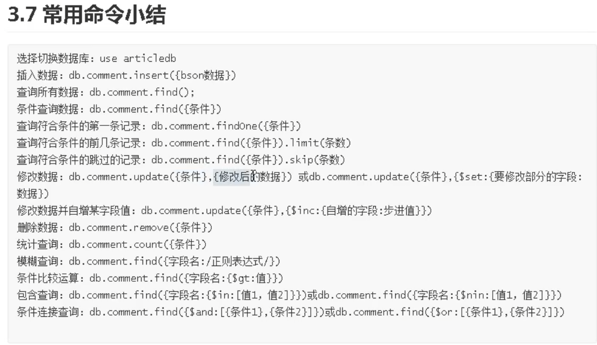

# mongoDB学习笔记

mongod.conf文件


## MongoDB卸载

linux下的卸载命令

1.停止 mongodb服务

`sudo service mongod stop`

2.卸载mongodb

`sudo apt-get remove mongodb`

3.移除相关包

```
sudo apt-get purge mongodb-org*

sudo apt-get purge mongodb

sudo apt-get autoremove

sudo apt-get autoclean
```

4.移除相关目录

```
sudo rm -r /var/log/mongodb
sudo rm -r /var/lib/mongodb
```

5.查看系统还有哪些残留的文件或目录

```
whereis mongo

whereis mongodb

whereis mongod

which mongo

which mongodb

which mongod
```

# Docker


Dockfile 自动化脚本

### 配置

windows下mongodb安装需要在bin同级目录下创建data文件夹

利用cmd将mongod.exe与data文件夹创建关联

```
mongod -dbpath=..\data\db
```

 使用shell链接

```
mongo --host=localhost --port=27017
```

#### linux安装

### 创建数据和日志目录。

创建一个目录，MongoDB实例将在该目录中存储其数据。例如：

```
sudo mkdir -p /var/lib/mongo
```

创建一个目录，MongoDB实例将在该目录中存储其日志。例如：

```
sudo mkdir -p /var/log/mongodb
```

启动MongoDB进程的用户必须具有对这些目录的读写权限。例如，如果您打算自己运行MongoDB：

```
sudo chown `whoami` /var/lib/mongo     # Or substitute another user
sudo chown `whoami` /var/log/mongodb   # Or substitute another user
```

#### 问题解决

出现`mongod.service: Failed with result 'exit-code'.`问题解决方法

新建两个目录

```
sudo mkdir /var/lib/mongodb
sudo mkdir /var/log/mongodb
```

改变拥有属性

```
sudo chown -R mongodb:mongodb /var/lib/mongodb
sudo chown -R mongodb:mongodb /var/log/mongodb
```

### 使用

```
use 数据库名
没有的话会自动创建

展示当前数据库,这个命令会展示当前运行的是哪个数据库
db

展示数据库
show dbs or database

```

admin：用户数据权限

local：

#### 删除数据库

进入数据库后，使用drop命令删除该数据库

```
use temp
db.dropDatabase()
```

#### 集合

显示创建

```
db.createCollection("my")
```

##### 集合删除

````
db.my.drop()
````

##### 集合插入

使用insert和save语句插入

```
db.集合名.insert
如果没有集合名会隐式的创建
插入成功
WriteResult({ "nInserted" : 1 })
```

批量插入

```
db.集合名.insertMany([
	{},
	{}.
])
类似json数组

```


##### 集合查询

```mongo
查询所有
db.集合名.find()
查询单个
db.集合名.find({aritcle:"1000"})
```

查询第一条数据，{}中写入要查询的数据

```
db.comment.findOne({articleid:"10001"})
```

#### 投影查询

我们对文档进行查询并不是需要所有的字段, 比如只需要 id 或者 用户名, 我们可以对文档进行“投影”

`db.commnet.find({article:id},{article:1})`表示只显示改行，`db.commnet.find({article:id},{article:1，_id:0})`表示排除主键

批量插入文档时，为了防止某一条数据插入错误，无法定位错误源。使用try/catch解决

主键id一般不自己生成

```
try{
db.集合名.insertMany(
	{},
	{},
	{}
	)
}catch(e){
	print(e)
}

try {
  db.comment.insertMany([
    {"_id":"1","articleid":"100001","content":"我们不应该把清晨浪费在手机上, 健康很重要, 一杯温水幸福你我 他.","userid":"1002","nickname":"相忘于江湖","createdatetime":new Date("2019-0805T22:08:15.522Z"),"likenum":NumberInt(1000),"state":"1"},
    {"_id":"2","articleid":"100001","content":"我夏天空腹喝凉开水, 冬天喝温开水","userid":"1005","nickname":"伊人憔 悴","createdatetime":new Date("2019-08-05T23:58:51.485Z"),"likenum":NumberInt(888),"state":"1"},
    {"_id":"3","articleid":"100001","content":"我一直喝凉开水, 冬天夏天都喝.","userid":"1004","nickname":"杰克船 长","createdatetime":new Date("2019-08-06T01:05:06.321Z"),"likenum":NumberInt(666),"state":"1"},
    {"_id":"4","articleid":"100001","content":"专家说不能空腹吃饭, 影响健康.","userid":"1003","nickname":"凯 撒","createdatetime":new Date("2019-08-06T08:18:35.288Z"),"likenum":NumberInt(2000),"state":"1"},
    {"_id":"5","articleid":"100001","content":"研究表明, 刚烧开的水千万不能喝, 因为烫 嘴.","userid":"1003","nickname":"凯撒","createdatetime":new Date("2019-0806T11:01:02.521Z"),"likenum":NumberInt(3000),"state":"1"}

]);

} catch (e) {
  print (e);
}
```

#### 文档的更新

语法

```
db.集合名.update({query},{update},options)
db.commnet.update()
```

覆盖性更新

这种更新方式会覆盖该条件下所有的数据项

```
 db.comment.update({_id:"1"},{userid:NumberInt(10)})
```

局部更新，只更新那一条数据

```
 db.comment.update({_id:"2"},{$set:{userid:NumberInt(10)}})
```

批量修改数据

更新所有查询数据

```
db.comment.update({userid:"1003"},{$set:{nickname:"list"}},{multi:true})
```

**列值增长修改**

如果我们想实现对某列值在原有值的基础上进行增加或减少, 可以使用 `$inc` 运算符来实现

```
db.comment.update({_id:"3"},{$inc:{likenum:NumberInt(1)}})
```

**删除文档**

```
db.集合名.remove(选项)
删除某一项
```

### 文档的分页查询

1. 统计所有记录数

```
db.集合名.count()
```

2. 按条件统计记录数

```
db.集合名.count({条件})
```

3. 分页列表查询

`db.comment.find({},{userid:"1003"})`其中find({},{条件})会限制其他条件的出现，导致仅出现userid这一个

仅显示前几条数据

```
db.集合名.find().limit(数字)
```

skip方法，跳过查询出来所有的n条数据

```
db.集合名.find().limit(数字).skip(n)
```

4. 排序查询

`db.集合名.find().sort({userid:1})`查询出来的数据，按照userid进行升序排列，1表示升序，0表示降序排列

##### 正则查询

```
db.集合名.find({content:/开水/})
后面紧跟着正则查询
```

##### 比较查询

```
db.集合名.find({field:{$gt:value}}) //大于：field>value
```

##### 包含查询

查询评论的集合中userid字段包含1003或1004的文档id in{1,2,3}

`db.comment.find({userid:{$in:["1003","1004"]}})`

不包含使用`$nin`操作符，查询出的结果不包含这几个文档

##### 连接查询

```
db.comment.find({$and:[{条件1}，{条件2]})
db.集合名.find($and:[{likenum:{$gte:NumberInt(700)}},{likenum:{$lt:NumberInt(2000)}}])
```

#### 常用小结



### 索引

索引是为了减少查询的条数


在某一个字段建立索引，使得该字段从大到小或者从小到大排列，后面的查询可以提高效率

**复合索引**

多个字段的用户定义索引，列出的字段顺序具有重要意义 ，例如`{userid:1,score:-1}`组成，则索引首先按userid正序排序，然后按score倒序排序

#### 索引的查看

返回一个集合中的所有索引的数组。

```
db.集合名.getIndexes()
```


_id:表示升序

#### 创建索引

```
db.集合名.createIndex(keys,options)
```


单字段索引示例

```
db.comment.createIndex({userid:1})
建立一个升序的索引
```


##### 索引的删除


```
db.集合名.dropIndex(index)
删除userid的升序索引
db.comment.dropIndex({userid:1})
删除所有索引
db.comment.dropIndexes()
```

<<<<<<< HEAD
#### 执行计划

想知道查询结果是否有效

```
db.collection.find(query,options).explain(options)

```

=======
#### 索引的使用

**执行计划**

分析查询性能，解释计划，查看查询的情况，如查询耗费时间，是否基于索引查询等

```
db.集合名.find(query，options).explain(options)
```

关键点看： "stage" : "COLLSCAN", 表示全集合扫描。

**涵盖的查询**

当查询条件和和查询的投影仅包含索引字段时，MongoDB直接从索引返回结果，就不会去扫描文档，使得查询速度非常快


## 文章评论

实现功能：

- 基本增删改查API
- 根据文章id查询评论
- 评论点赞

#### 表结构分析


#### spring配置

使用spring来搭建服务架构

使用mongoDB框架来链接spring

```java
<dependency>
            <groupId>org.springframework.boot</groupId>
            <artifactId>spring-boot-starter-data-mongodb</artifactId>
        </dependency>
```

**yml配置**

```java
spring:
  data:
    mongodb:
#      主机名
      host: 127.0.0.1
#      数据库
      database: articledb
#      默认端口
      port: 27017
```

**启动类**

使用springboot不需要添加启动类

运行启动类，观察是否报错，是否出现一下语句

```
[           main] org.mongodb.driver.cluster               : Cluster created with settings {hosts=[127.0.0.1:27017], mode=SINGLE, requiredClusterType=UNKNOWN, serverSelectionTimeout='30000 ms'}
```

**实体类**

可能出现一个collection对应多个实体类

```Java

@Data
// 可以省略，如果省略，则默认使用类名小写
@Document(collection = "comment")
// 复合索引,推荐使用命令行构建
@CompoundIndex(def = "{'userid':1,'nickname':-1}")
public class Comment {
//    主键标识
    @Id
    private String id;
//    该字段对应mongodb的字段的名字，如果一致，则无需该注解
//    @Field("content")
    private String content;
    private Date publishtime;
//    添加了一个单字段索引
    @Indexed
    private String userid;
    private String nickname;
    private LocalDateTime createdatetime;
    private Integer likenum;
    private Integer replynum;
    private String state;
    private String parentid;
    private String articleid;

    @Override
    public String toString() {
        return "Comment{" +
                "id='" + id + '\'' +
                ", content='" + content + '\'' +
                ", publishtime=" + publishtime +
                ", userid='" + userid + '\'' +
                ", nickname='" + nickname + '\'' +
                ", createdatetime=" + createdatetime +
                ", likenum=" + likenum +
                ", replynum=" + replynum +
                ", state='" + state + '\'' +
                ", parentid='" + parentid + '\'' +
                ", articleid='" + articleid + '\'' +
                '}';
    }
}
```


**测试**

如果不指定id，mongodb会自动生成一个ID，类似UUID的写法

```java
    /**
     * 保存一个评论
     */
    @Test
    public void testSaveComment(){
        Comment comment=new Comment();
        comment.setArticleid("100000");
        comment.setContent("测试添加的数据");
        comment.setCreatedatetime(LocalDateTime.now());
        comment.setUserid("1003");
        comment.setNickname("凯撒大帝");
        comment.setState("1");
        comment.setLikenum(0);
        comment.setReplynum(0);
        commentService.saveComment(comment);
    }
```

#### 根据上机ID查询文章评论的分页列表

commentrepository新增方法定义

评论点赞

根据id查询出用户当前点赞数，将当前点赞数+1，然后保存至数据库。

简单易实现，但是IO过大

```java
/**
* 点赞-效率低
* @param id
*/
public void updateCommentThumbupToIncrementingOld(String id){
Comment comment = CommentRepository.findById(id).get();
comment.setLikenum(comment.getLikenum()+1);
CommentRepository.save(comment);
}
```

使用mongoTemplate来实现对某列的操作，变更service的写法

```java
	@Autowired
    MongoTemplate mongo;    
	/**
     * 适应大规模动态更新点赞情况
     */
    public void updateCommentLikenum(String id){
//        查询对象
        Query query = Query.query(Criteria.where("_id").is(id));
//        更新对象
        Update update=new Update();
        update.inc("likenum");
//        参数1：查询对象
//        参数2：更新对象
//        参数3：集合的名字或实体类的类型comment.class
        mongo.updateFirst(query,update,"comment");
    }

```

测试更新的可用性

```java
@Test
    public void testUpdateCommentLikenum(){
        commentService.updateCommentLikenum("1");
    }
```

## 集群和安全


副本集架构目标

一主一副本一仲裁，在同一台云服务器上为了区分彼此，采用不同的端口号构建相应的服务


### MongoDB在SpringBoot中

mongoTemplate

https://docs.spring.io/spring-data/mongodb/docs/3.2.6/reference/html/#dependencies

### Spring Data MongoDB

CrudRepository接口提供复杂的CRUD功能

## GeoSpatial Queries

MongoDB通过命令`$near`,`$within`,`geoWithin`和`$nearSphere`提供地理空间查询。特定于地理空间查询的方法在`Criteria`类中可用。

### $ match（汇总）

筛选文档以仅将符合指定条件的文档传递到下一个管道阶段。用于aggreate中，使用表达式进行查询

```
{ $match: { <query> } }
```

$match获取指定查询条件的文档。查询语法与读取操作查询语法相同。即 $match不接受原始聚合表达式。而是使用$expr查询表达式在中包含聚合表达式$match。

#### 限制

- 该[`$match`](https://mongodb.net.cn/manual/reference/operator/aggregation/match/#pipe._S_match)查询语法等同于[读出操作查询](https://mongodb.net.cn/manual/tutorial/query-documents/#read-operations-query-argument)语法; 即 [`$match`](https://mongodb.net.cn/manual/reference/operator/aggregation/match/#pipe._S_match)不接受[原始聚合表达式](https://mongodb.net.cn/manual/meta/aggregation-quick-reference/#aggregation-expressions)。要在中包含聚合表达式 [`$match`](https://mongodb.net.cn/manual/reference/operator/aggregation/match/#pipe._S_match)，请使用[`$expr`](https://mongodb.net.cn/manual/reference/operator/query/expr/#op._S_expr)查询表达式：

  ```
  { $match: { $expr: { <aggregation expression> } } }
  ```

- 您不能[`$where`](https://mongodb.net.cn/manual/reference/operator/query/where/#op._S_where)在[`$match`](https://mongodb.net.cn/manual/reference/operator/aggregation/match/#pipe._S_match)查询中将其用作聚合管道的一部分。

- 您不能在聚合管道中使用[`$near`](https://mongodb.net.cn/manual/reference/operator/query/near/#op._S_near)或[`$nearSphere`](https://mongodb.net.cn/manual/reference/operator/query/nearSphere/#op._S_nearSphere)在 [`$match`](https://mongodb.net.cn/manual/reference/operator/aggregation/match/#pipe._S_match)查询中使用它。或者，您可以：

  - 使用[`$geoNear`](https://mongodb.net.cn/manual/reference/operator/aggregation/geoNear/#pipe._S_geoNear)阶段而不是[`$match`](https://mongodb.net.cn/manual/reference/operator/aggregation/match/#pipe._S_match)阶段。
  - 在阶段或 中使用[`$geoWithin`](https://mongodb.net.cn/manual/reference/operator/query/geoWithin/#op._S_geoWithin)查询运算符。[`$center`](https://mongodb.net.cn/manual/reference/operator/query/center/#op._S_center)[`$centerSphere`](https://mongodb.net.cn/manual/reference/operator/query/centerSphere/#op._S_centerSphere)[`$match`](https://mongodb.net.cn/manual/reference/operator/aggregation/match/#pipe._S_match)

- 要[`$text`](https://mongodb.net.cn/manual/reference/operator/query/text/#op._S_text)在[`$match`](https://mongodb.net.cn/manual/reference/operator/aggregation/match/#pipe._S_match)阶段中使用， **[`$match`](https://mongodb.net.cn/manual/reference/operator/aggregation/match/#pipe._S_match)阶段必须是管道的第一阶段**。

#### 例子

这些示例使用以`articles`以下文档命名的集合：

```
{ "_id" : ObjectId("512bc95fe835e68f199c8686"), "author" : "dave", "score" : 80, "views" : 100 }
{ "_id" : ObjectId("512bc962e835e68f199c8687"), "author" : "dave", "score" : 85, "views" : 521 }
{ "_id" : ObjectId("55f5a192d4bede9ac365b257"), "author" : "ahn", "score" : 60, "views" : 1000 }
{ "_id" : ObjectId("55f5a192d4bede9ac365b258"), "author" : "li", "score" : 55, "views" : 5000 }
{ "_id" : ObjectId("55f5a1d3d4bede9ac365b259"), "author" : "annT", "score" : 60, "views" : 50 }
{ "_id" : ObjectId("55f5a1d3d4bede9ac365b25a"), "author" : "li", "score" : 94, "views" : 999 }
{ "_id" : ObjectId("55f5a1d3d4bede9ac365b25b"), "author" : "ty", "score" : 95, "views" : 1000 }
```

#### 平等匹配

以下操作用于[`$match`](https://mongodb.net.cn/manual/reference/operator/aggregation/match/#pipe._S_match)执行简单的相等匹配：

```
db.articles.aggregate(
    [ { $match : { author : "dave" } } ]
);
```

[`$match`](https://mongodb.net.cn/manual/reference/operator/aggregation/match/#pipe._S_match)选择将选择`author` 字段等于的文档`dave`，并且聚合返回以下内容：

```
{ "_id" : ObjectId("512bc95fe835e68f199c8686"), "author" : "dave", "score" : 80, "views" : 100 }
{ "_id" : ObjectId("512bc962e835e68f199c8687"), "author" : "dave", "score" : 85, "views" : 521 }
```

#### 执行计数

以下示例选择要使用[`$match`](https://mongodb.net.cn/manual/reference/operator/aggregation/match/#pipe._S_match)管道运算符处理的文档 ，然后将结果通过[`$group`](https://mongodb.net.cn/manual/reference/operator/aggregation/group/#pipe._S_group)管道传输到管道运算符以计算文档计数：

```
db.articles.aggregate( [
  { $match: { $or: [ { score: { $gt: 70, $lt: 90 } }, { views: { $gte: 1000 } } ] } },
  { $group: { _id: null, count: { $sum: 1 } } }
] );
```

在凝集管道，[`$match`](https://mongodb.net.cn/manual/reference/operator/aggregation/match/#pipe._S_match)选择的文件，其中任一`score`大于`70`和小于`90` 或`views`大于或等于`1000`。然后将这些文档通过管道传输[`$group`](https://mongodb.net.cn/manual/reference/operator/aggregation/group/#pipe._S_group)到进行计数。聚合返回以下内容：

```
{ "_id" : null, "count" : 5 }
```

### $ group（汇总）

按指定的`_id`表达式对输入文档进行分组，并针对每个不同的分组输出文档。`_id`每个输出文档的字段都包含唯一的按值分组。输出文档还可以包含包含某些[累加器表达式](https://mongodb.net.cn/manual/reference/operator/aggregation/group/#accumulators-group)值的计算字段。

该[`$group`](https://mongodb.net.cn/manual/reference/operator/aggregation/group/#pipe._S_group)阶段具有以下原型形式：

```
{
  $group:
    {
      _id: <expression>, // Group By Expression
      <field1>: { <accumulator1> : <expression1> },
      ...
    }
 }
```

以下聚合操作使用该[`$group`](https://mongodb.net.cn/manual/reference/operator/aggregation/group/#pipe._S_group)阶段来计算`sales`集合中文档的数量：

```
db.sales.aggregate( [
  {
    $group: {
       _id: null,
       count: { $sum: 1 }
    }
  }
] )
```

该操作返回以下结果：

```
{ "_id" : null, "count" : 8 }
```

此聚合操作等效于以下SQL语句：

```
SELECT COUNT(*) AS count FROM sales
```

#### 检索重复值

以下聚合操作使用该[`$group`](https://mongodb.net.cn/manual/reference/operator/aggregation/group/#pipe._S_group)阶段从`sales`集合中检索不同的项目值：

此处的id不为null，则开始统计

```
db.sales.aggregate( [ { $group : { _id : "$item" } } ] )
```

该操作返回以下结果：

```
{ "_id" : "abc" }
{ "_id" : "jkl" }
{ "_id" : "def" }
{ "_id" : "xyz" }
```

### $ project（汇总）

将带有请求字段的文档传递到管道的下一个阶段。指定的字段可以是输入文档中的现有字段，也可以是新计算的字段。

```
{ $project: { <specification(s)> } }
```

下[`$project`](https://mongodb.net.cn/manual/reference/operator/aggregation/project/#pipe._S_project)阶段只包括`_id`， `title`和`author`在其输出文档的字段，类似于投影或者说就是投影

```
db.books.aggregate( [ { $project : { title : 1 , author : 1 } } ] )
```

该操作产生以下文档：

```
{ "_id" : 1, "title" : "abc123", "author" : { "last" : "zzz", "first" : "aaa" } }
```

## 投影

Spring Data查询方法通常返回由根存储库管理聚合的一个或者多个实例。然而，它可能、

### 聚合

将多个文档的值组会在一起，并且可以对分组的数据执行各种操作以返回单个结果。MongoDB提供了三种执行聚合的方式：[聚合管道](https://mongodb.net.cn/manual/aggregation/#aggregation-framework)，[map-reduce函数](https://mongodb.net.cn/manual/aggregation/#aggregation-map-reduce)和[单一目的聚合方法](https://mongodb.net.cn/manual/aggregation/#single-purpose-agg-operations)。

聚合的每一个单独阶段都可以作为下一个阶段的输入。

在这个例子中

```
db.orders.aggregate([
   { $match: { status: "A" } },
   { $group: { _id: "$cust_id", total: { $sum: "$amount" } } }
])
```

**第一阶段**：[`$match`](https://mongodb.net.cn/manual/reference/operator/aggregation/match/#pipe._S_match)阶段按`status`字段过滤文档，并将`status`等于的文档传递到下一阶段`"A"`。参考平等匹配

**第二阶段**：该[`$group`](https://mongodb.net.cn/manual/reference/operator/aggregation/group/#pipe._S_group)阶段按`cust_id`字段将文档分组，以计算每个唯一值的总和`cust_id`。

最基本的管道阶段提供*过滤器*，其操作类似于查询和修改输出文档形式的*文档转换*。

其他管道操作提供了用于按特定字段对文档进行分组和排序的工具，以及用于聚合包括文档数组在内的数组内容的工具。另外，管道阶段可以将[运算符](https://mongodb.net.cn/manual/reference/operator/aggregation/#aggregation-expression-operators)用于诸如计算平均值或连接字符串之类的任务。

## 返回人口超过1000万的州

以下汇总操作将返回总人口超过1000万的所有州：

```
db.zipcodes.aggregate( [
   { $group: { _id: "$state", totalPop: { $sum: "$pop" } } },
   { $match: { totalPop: { $gte: 10*1000*1000 } } }
] )
```

在此示例中，[聚合管道](https://mongodb.net.cn/manual/core/aggregation-pipeline/#id1) 包括[`$group`](https://mongodb.net.cn/manual/reference/operator/aggregation/group/#pipe._S_group)以下 [`$match`](https://mongodb.net.cn/manual/reference/operator/aggregation/match/#pipe._S_match)阶段：

- 该[`$group`](https://mongodb.net.cn/manual/reference/operator/aggregation/group/#pipe._S_group)阶段`zipcode` 按`state`字段将集合的文档分组，`totalPop`为每个状态计算字段，并为每个唯一状态输出文档。

  新的按状态的文档有两个字段：`_id`字段和`totalPop`字段。该`_id`字段包含`state`; 的值 ；即按字段分组。该`totalPop`字段是包含每个州的总人口的计算字段。要计算该值，请[`$group`](https://mongodb.net.cn/manual/reference/operator/aggregation/group/#pipe._S_group)使用[`$sum`](https://mongodb.net.cn/manual/reference/operator/aggregation/sum/#grp._S_sum) 运算符`pop`为每个州添加人口字段（）。

  在该[`$group`](https://mongodb.net.cn/manual/reference/operator/aggregation/group/#pipe._S_group)阶段之后，管道中的文档类似于以下内容：

  ```
  {
    "_id" : "AK",
    "totalPop" : 550043
  }
  ```

- 该[`$match`](https://mongodb.net.cn/manual/reference/operator/aggregation/match/#pipe._S_match)阶段过滤这些分组的文档以仅输出`totalPop`值大于或等于1000万的那些文档。该[`$match`](https://mongodb.net.cn/manual/reference/operator/aggregation/match/#pipe._S_match)阶段不会更改匹配的文档，但会输出未修改的匹配文档。

此聚合操作的等效[SQL](https://mongodb.net.cn/manual/reference/glossary/#term-sql)为：

```
SELECT state, SUM(pop) AS totalPop
FROM zipcodes
GROUP BY state
HAVING totalPop >= (10*1000*1000)
```

```
db.mobileCustomer.aggregate([{$unwind:"$customerLocation"},{$match:{mobileId:"520","customerLocation.logicStatus":0}},{$project:{mobileId:1,location:"$customerLocation.geoPoint"}}])
```

```
 db.mobileCustomer.aggregate([{$geoNear:{near:{ type: "Point", coordinates: [ -73.98142 , 40.71782 ] }},key:"customerLocation.geoPoint",distanceField:"dist.calculate",minDistance:10}])
 
  db.mobileCustomer.aggregate([
  {$geoNear:{near:{type:"Point",coordinates:[-73.98142,40.71782]}},key:"customerLocation.geoPoint",minDistance:10}])
  
   db.mobileCustomer.aggregate([{$unwind:"$customerLocation"},{$match:{mobileId:"520","customerLocation.logicStatus":0}},{$project:{mobileId:1,location:"$customerLocation.geoPoint"}},{$geoNear:{near:{ type: "Point", coordinates: [ -73.98142 , 40.71782 ] }},key:"location",distanceField:"dist.calculate",minDistance:10}])
   
   db.mobileCustomer.aggregate([{$unwind:"$customerLocation"},{$geoNear:{near:{ type: "Point", coordinates: [ -73.98142 , 40.71782 ] }},key:"customerLocation.geoPoint",distanceField:"dist.calculate",minDistance:10,query:{"customerLocation.logicStatus":0}}])
   
   
```


