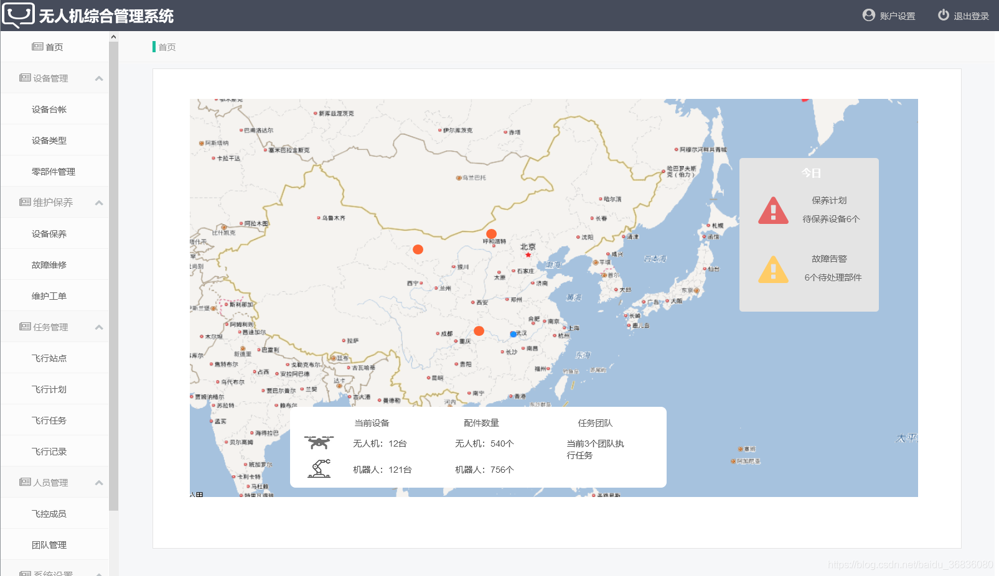
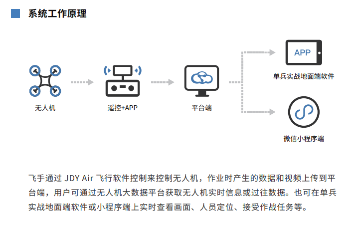

# 无人机

## 无人机采集的数据

激光点云：实际上就是获取一个三维坐标；(包括位置、距离、时间、方位/角度、回波、强度)

是利用激光在同一空间参考系下获取物体表面，每个采样点的空间坐标，得到的是一系列表达目标空间分布和目标表面特性的海量点的集合，这个点集合就称之为“点云”(Point Cloud)。

- 激光点云数据

应用基于激光点数据的杆塔和导线提取算法，获取导地线和杆塔的地理参考信息（包括位置、距离、时间、方位/角度、回波、强度数据），获取的数据主要有三类：差分GPS数据，IMU数据和激光扫描测距数据，GPS数据和IMU数据统称为POS数据

- 可见光影像数据

用于检测电力线路外观缺陷及环境导通状况

- 红外影像数据

用于检测温度异常情况，检测出 绝缘子局部及导线接头异常发热等缺陷

测绘数据的测量：部分专业机构采用无人机测量测绘

- UAVid Dataset

这个数据集包括八个分类,主要为图像数据

> - Building
> - Road
> - Static car
> - Tree
> - Low vegetation
> - Human
> - Moving car
> - Background clutter

**目前主要的数据都是图像类数据**，可以加入坐标信息处理

## 无人机价格

经纬 M300 RTK ￥72000

经纬 M210 RTK V2

精灵4RTK ￥24000

Phantom 4 Pro V2.0 ￥10000

“御”Mavic 2 行业双光版 ￥20000+2800

## 自定义无人机开发

目前大疆的M100提供SDK可以自己进行飞行器的开发。不过目前提供的接口只有飞行器的速度，位置，自主起飞降落什么的控制接口。如果要把视频远程传到客户端....这个··· 我觉得你可能需要自己开发一下视频流的传输什么的。

**目前进行无人机二次开发的，支持图像数据实时回传，并进行远程控制的有经纬系列**

## 无人机在线管理平台

### 无人机

无人机调度管理配合iWinSky第二代无人机飞行控制系统、适航环测系统、自动充电系统、专业的数据传输、图像传输系统以及云台控制系统等一系列高科技手段，真正意义上实现了无人机无人操控的目标，具有超远程控制，自由调度，计划任务，适航管控，设备检测，维护预警等特点,更有效地配合文物保护工作。该系统同时支持iPhone、Android、PC、平板等终端设备同时使用,使用户操控更智能、更简单、更机动。

**其他系统页面**

## 目前存在的系统

大疆

- 无人机指挥调度系统，筋斗云团队

[无人机指挥调度平台 (jdyair.com)](https://jdyair.com/product/platfor m.html)

集无人机/无人车/无人船/水下机器人等多种单兵设备的统一指挥调度，能够远程控制单兵设备的云台角度和变焦，对设备进行统一管理和数据的存储统计，满足对单兵设备的指挥调度需求。

这个团队保留了飞手的存在

- 南京柠瑛智能

[南京柠瑛智能科技有限公司-无人机AI+IOT云服务平台 (ningyingai.com)](http://www.ningyingai.com/product.shtml)

>#### “无人机AI APP端+WEB端+3D大屏可视化”空地一体综合管理平台
>
>APP端采集的航拍数据上传到云服务端后,云端对含有目标（如违建建筑等）的航拍数据进行自动分析，飞完即可出具飞行区域的违建巡检报告。巡检报告可统计每次无人机飞行的航线名称、无人机飞控序列号、航线类型、飞行高度、航向重叠率、旁向重叠率、主航向角度、规划时间以及无人机的起飞降落时间、起飞地点、飞行时长等，并通过航拍对比分析，将多次飞行在相同区域中AI识别的目标进行比对。

### 需要实现的功能

- 实时记录飞行状态并会回传

显示飞行器飞行状态信息功能，显示信息应至少包括高度、经度、纬度、电池电量、飞行轨迹、飞行速度、姿态等信息。控制机载影像设备实时回传视频图像信号,控制云台动作并显示其姿态信息功能。

- 轨迹规划

调度管控平台，根据实际情况进行调度，改变飞行路线

- 飞行器管理

人为切换至返航模式或者出现异常情况，系统会自动调度无人机依原航线返航或前往就近的迫降地点。

实现锚点飞行路线规划 **可以导入批量的GPS点进行多点规划**

### 特点

地面数据收集，调度路线，

### 功能界面

主要还是分为3个端

> 无人机 > 遥控器 > web端
>
> 

飞行器列表

路线管理

视角切换

> 具有视角切换的功能，切换到无人机的视角进行微操

## 其他教程

**XTDrone使用文档**

[XTDrone使用文档 · 语雀 (yuque.com)](https://www.yuque.com/xtdrone/manual_cn)

