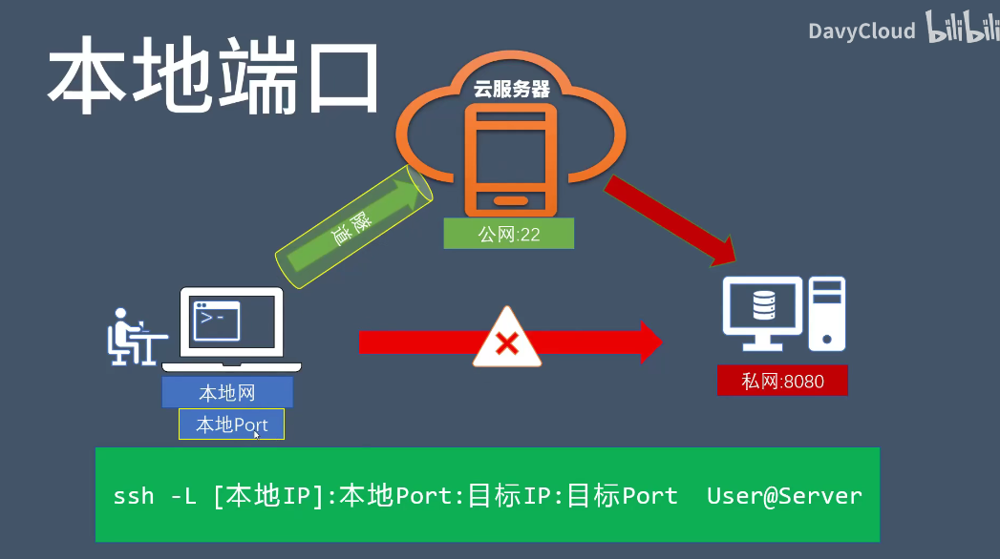
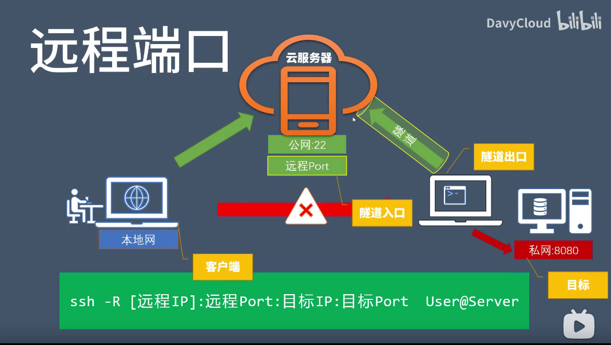

# 计算机网络

### ssh服务

将其他 `TCP` 端口的网络数据通过 `SSH` 链接来转发，这一过程有时也被叫做 **隧道（tunneling）**。

转发的类型有 3 种，对应到 3 个选项，分别是：

- `-L`：Local，即本地端口转发
- `-R`：Romote，即远程端口转发
- `-D`：Dynamic，即动态端口转发

## **本地端口转发**

把本地的端口转发到服务器上，实现访问本地端口，实际访问的是远程端口

基本命令:

```text
ssh -L [本地IP]:本地端口:目标主机:目标端口 SSH服务器
```

1. 本地指的是 SSH 客户端，即执行这个 ssh 命令的机器
2. 本地 IP 省略时，默认绑定到 `127.0.0.1`
3. 指定本地 IP 时，必须是本地已存在的地址
4. 目标主机可以是主机名，也可以是 IP
5. SSH 服务器是转发方
6. 如果目标主机是主机名，要求 SSH 服务器 能够解析

示例：

```
ssh -L 8000:localhost:8080 remote
```

从中介访问私网端口，跳过限制



本地IP访问远端，把本地的端口转发至远程端口

`ssh -L 192.168.2.131:8080:localhost:8080 root@47.`

把远端的8080端口绑定到本地的localhost或者ip上，绑定在ip上可以实现局域网内的计算机都可以访问


## **远程端口转发**

基本命令：

```text
ssh -R [远程IP]:远程端口:目标主机:目标端口 SSH服务器
```

1. 远程指的是 SSH 服务器
2. 远程 IP 省略时，默认绑定到 `127.0.0.1`
3. 要指定远程 IP 需要 SSH 服务器端开启 `GatewayPorts` 选项
4. 目标主机可以是主机名，也可以是 IP
5. SSH 客户端是转发方
6. 如果目标主机是主机名，要求 SSH 客户端 能够解析

示例：

```text
ssh -R 8000:localhost:8080 remote
```

解释：

在 `remote` 上面启动 `8000` 端口，可以访问到本地的 `8080` 端口，这里的 `localhost` 指的是 SSH 客户端 本地。

在 `/etc/ssh/sshd_config` 配置文件中找到 `GatewayPorts`，设置为 `yes`，并重启 `sshd` 服务。

备注：

通过一个跳板机访问私有网络

